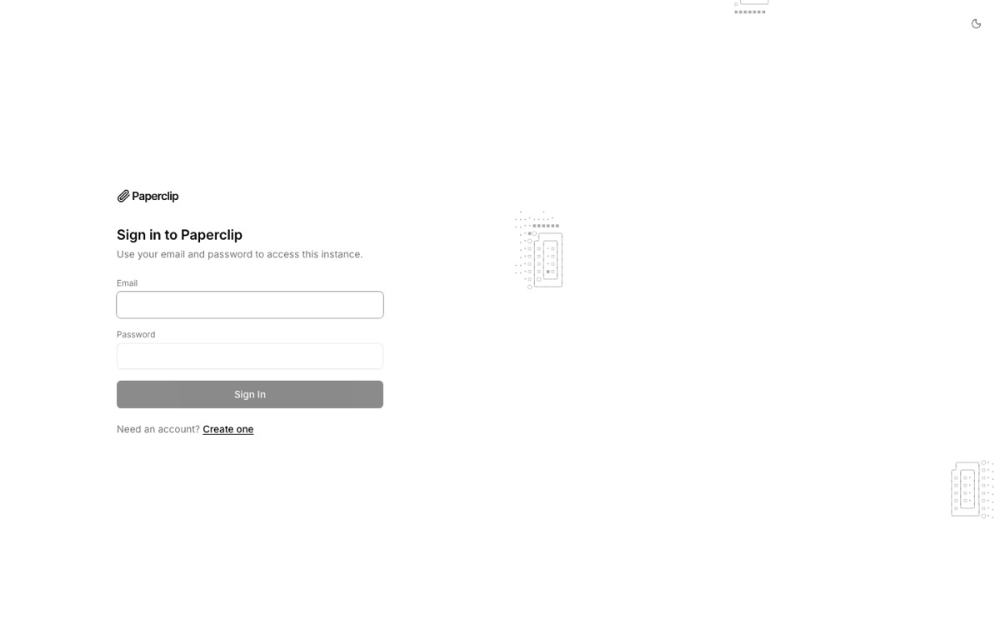
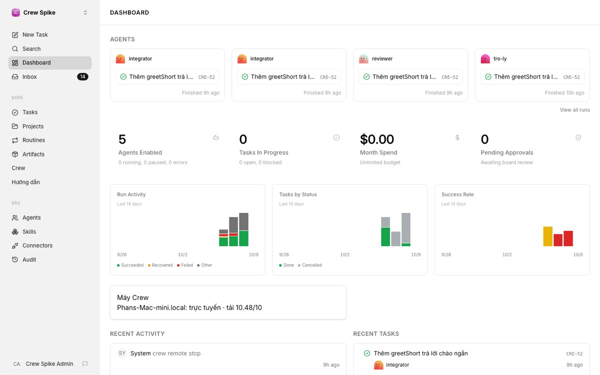
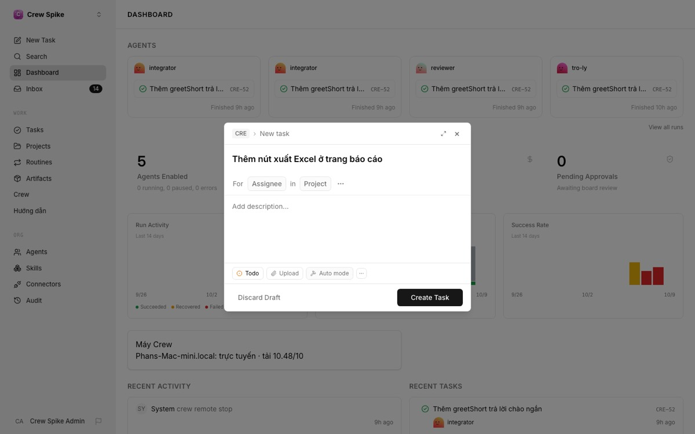
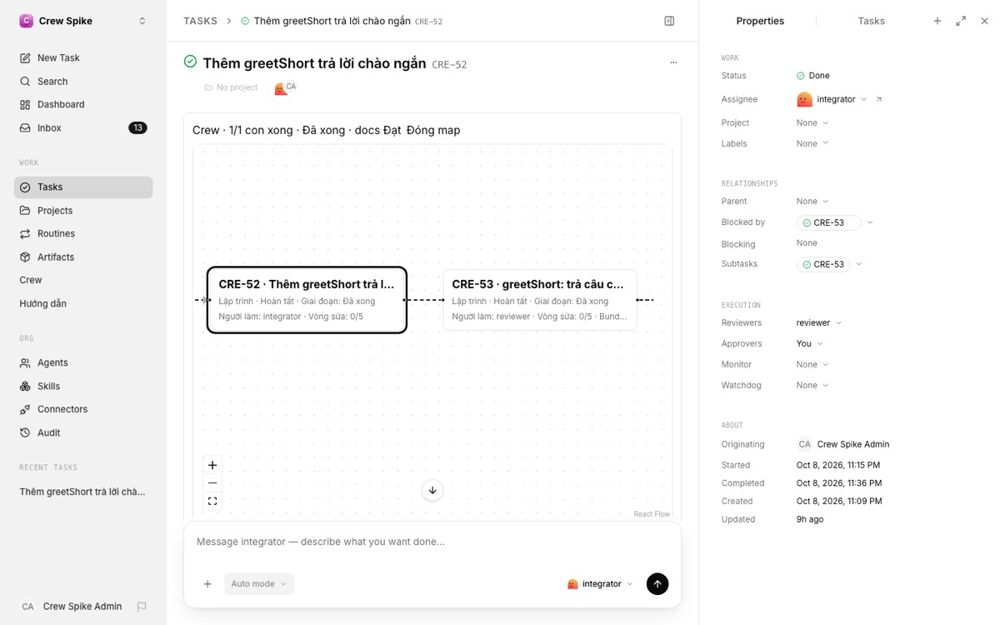
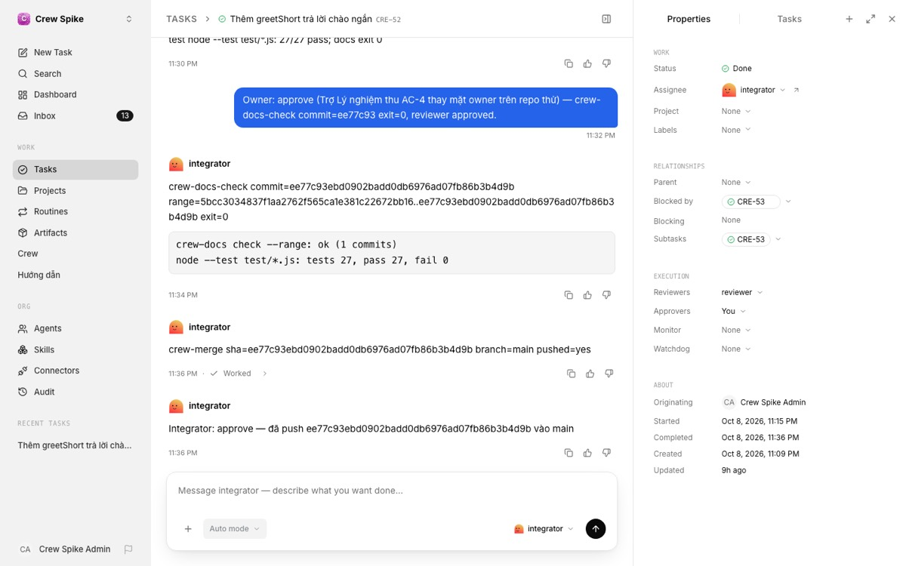
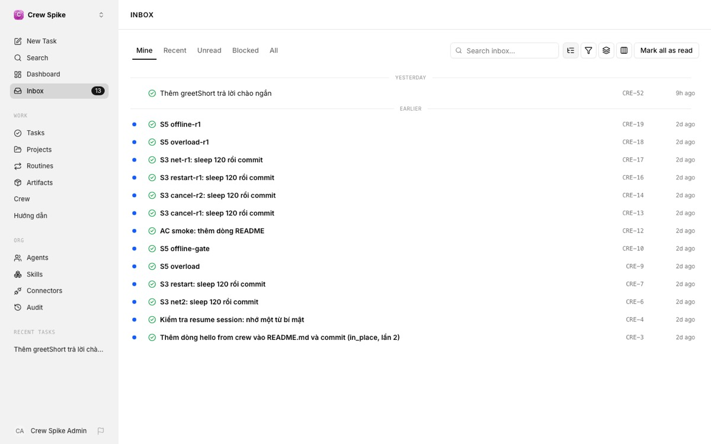
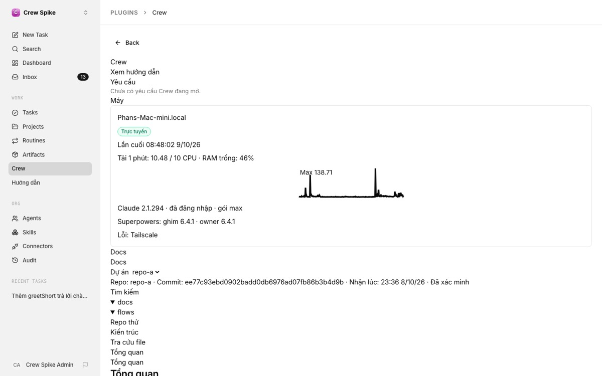
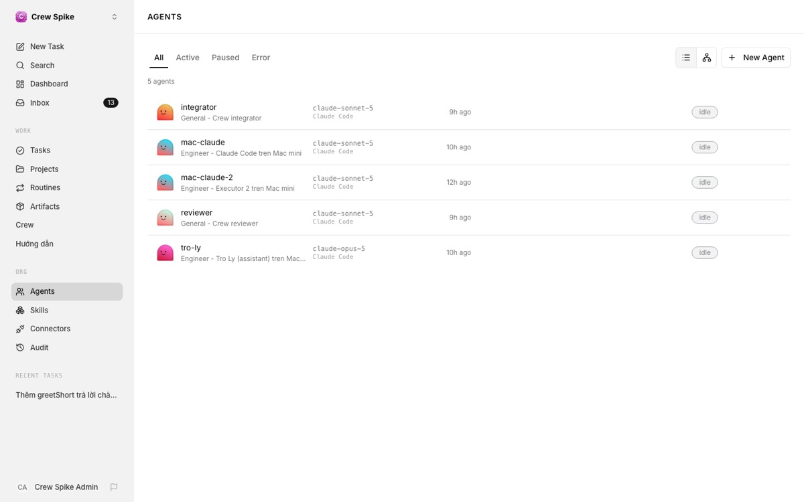
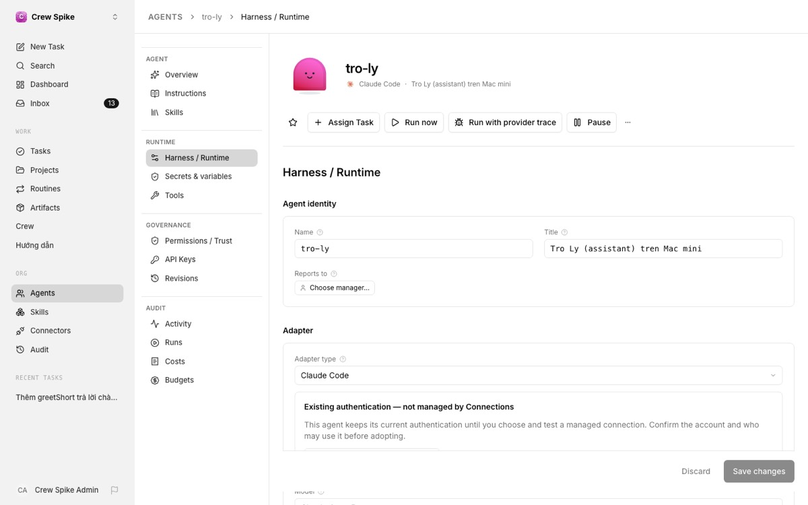
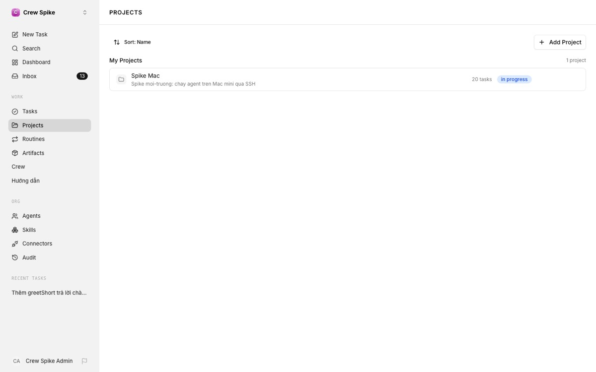

# Hướng dẫn sử dụng 2P Crew

2P Crew là một đội agent AI biết lập trình. Bạn viết yêu cầu bằng lời, ví dụ "thêm nút xuất Excel ở trang báo cáo". Đội agent tự chia việc, viết code, tự review, cập nhật tài liệu và đẩy code lên nhánh chính. Bạn chỉ cần trả lời khi được hỏi và duyệt ở bước cuối.

Hướng dẫn này viết cho người **mới vào lần đầu**. Đọc từ trên xuống: phần 1 trả lời "tôi có phải cài đặt gì không", phần 2–6 là cách dùng hằng ngày, phần 7–9 để tra cứu khi cần.

---

## 1. Lần đầu vào: có cần tạo gì không?

**Không cần.** Mọi thứ đã được dựng sẵn:

| Đã có sẵn | Là gì |
|---|---|
| **Công ty "2P Solutions"** | Không gian làm việc chứa toàn bộ yêu cầu và agent. Không phải tạo công ty mới |
| **5 agent** | Trợ Lý, 2 người viết code (executor), 1 người review (reviewer), 1 người tích hợp (integrator) |
| **Mac mini đã nối** | Agent chạy Claude Code trên Mac mini ở nhà. Web nói chuyện với Mac qua mạng riêng Tailscale |
| **Luật làm việc** | Mỗi yêu cầu code đi 4 bước duyệt, có kiểm tài liệu tự động, tối đa 5 vòng sửa |

Việc bạn cần làm chỉ gồm: **đăng nhập, giao yêu cầu cho Trợ Lý, trả lời câu hỏi, duyệt kết quả.**

Có hai việc thiết lập không làm được trên web. Khi cần, bạn nhắn **Trợ Lý trong Claude Code** (gõ `/tro-ly …` trên máy của bạn):
- **Đưa một dự án thật mới vào cho agent làm.** Hiện agent làm trên repo thử `repo-a`. Mỗi agent làm việc trong một thư mục repo trên Mac do người quản trị chỉ định, nên muốn agent làm repo khác thì phải dựng thư mục làm việc cho repo đó.
- **Thêm người dùng, thêm máy Mac, đổi mật khẩu.**

---

## 2. Đăng nhập



1. Mở **https://crew.2p-solutions.com**.
2. Nhập **Email** và **Password** rồi bấm **Sign In**.
3. Đăng nhập xong sẽ vào Dashboard.

Lưu ý:
- Dòng "Need an account? Create one" vẫn hiện nhưng **không tạo được tài khoản**. Đăng ký tự do đã tắt để người lạ không vào được.
- Nếu trang cứ quay "đang tải" mãi: tải lại trang hoặc mở tab ẩn danh. Thường là do trình duyệt còn giữ phiên cũ.

---

## 3. Làm quen màn hình chính



**Thanh bên trái:**
- **New Task**: tạo yêu cầu mới. Đây là nút dùng nhiều nhất.
- **Dashboard**: tổng quan. Có các agent vừa làm gì, biểu đồ run, và ô **Máy Crew** cho biết Mac đang trực tuyến hay không.
- **Inbox**: những thứ đang chờ bạn, gồm câu hỏi của Trợ Lý và việc cần duyệt. Con số bên cạnh là số mục chưa đọc.
- **Tasks**: mọi yêu cầu và việc con.
- **Crew**: trang tổng hợp của Crew, xem mục 6.
- **Hướng dẫn**: trang bạn đang đọc.
- **Agents**: danh sách agent. Thường bạn không cần vào.

Các mục Routines, Artifacts, Skills, Connectors và Audit là tính năng gốc của Paperclip, Crew không dùng tới.

---

## 4. Giao một yêu cầu



1. Bấm **New Task** ở thanh bên trái.
2. Ô đầu tiên là **tiêu đề**, viết ngắn gọn. Ví dụ: *Thêm nút xuất Excel ở trang báo cáo*.
3. Ở ô **For … Assignee**, bấm rồi chọn **tro-ly** (Trợ Lý). **Bắt buộc**: không giao cho ai thì không agent nào làm.
4. Ô **Add description…** là mô tả chi tiết. Nên ghi:
   - **muốn gì** và **vì sao**;
   - **ở chỗ nào**: trang nào, phần nào;
   - **cái gì không được đụng**, nếu có.
5. Trạng thái để **Todo** như mặc định. Đừng chọn Backlog, vì Backlog thì agent không được đánh thức.
6. **Đừng chọn Reviewer hay Approver** trong dialog. Crew tự gắn luật duyệt.
7. Bấm **Create Task**.

**Ví dụ một yêu cầu tốt:**

> **Tiêu đề:** Thêm lời chào tiếng Nhật cho greet
>
> **Mô tả:** Hàm `greet` hiện chào được vi và en. Thêm `ja` ("こんにちは"), kèm test. Không đổi kết quả của vi và en.

**Ba loại yêu cầu:**

| Loại | Khi nào | Cách tạo |
|---|---|---|
| **Code** | Thêm hoặc sửa tính năng | Như trên (mặc định) |
| **Bug** | Có lỗi | Mô tả **triệu chứng**: "bấm X thì ra Y, đúng ra phải ra Z". Agent sẽ tìm nguyên nhân, viết test bắt được lỗi rồi mới sửa |
| **Nghiên cứu** | Cần so sánh hoặc đề xuất, không sửa code | Yêu cầu phải có nhãn **`research`** ngay lúc tạo. Dialog New Task chưa gắn được nhãn, nên nhờ Trợ Lý tạo yêu cầu nghiên cứu cho bạn. Gắn nhãn sau khi tạo thì không có tác dụng |

Mẹo: **một yêu cầu, một mục tiêu.** Hai mục tiêu không liên quan thì tạo hai yêu cầu. Thiếu thông tin cũng không sao, Trợ Lý sẽ hỏi lại.

---

## 5. Sau khi giao: theo dõi, trả lời, duyệt

### 5.1 Chuyện gì xảy ra

```
Bạn giao cho Trợ Lý
  → Trợ Lý đọc tài liệu dự án, hỏi lại nếu thiếu thông tin
  → Trợ Lý chia thành các việc con, chọn model cho từng việc, giao cho executor
  → executor viết code (test trước, code sau)  →  reviewer duyệt từng việc con
  → khi mọi việc con xong: 4 bước duyệt của yêu cầu gốc
     (1) Reviewer  →  (2) Integrator gộp code + kiểm tài liệu  →  (3) BẠN DUYỆT  →  (4) Integrator đẩy lên main
```

Một yêu cầu nhỏ thường mất 15–30 phút, tùy độ khó và độ bận của Mac.

### 5.2 Xem tiến độ ngay trong yêu cầu



Mở yêu cầu (từ **Tasks** hoặc **Inbox**). Ngay đầu trang có dòng tóm tắt:

> **Crew · 1/1 con xong · Đã xong · docs Đạt**

- **x/y con xong**: số việc con đã xong trên tổng số.
- **Bước hiện tại**:
  - *Reviewer*;
  - *Integrator · gộp + docs*;
  - *Owner duyệt*: đang chờ bạn;
  - *Integrator · đẩy*;
  - *Đã xong*.
- **docs**:
  - *Đạt*: tài liệu khớp code.
  - *Lỗi*: integrator sẽ sửa.
  - *Chưa có*: chưa tới bước kiểm.

Bấm **Mở map** để xem sơ đồ. Mỗi ô là yêu cầu gốc hoặc một việc con, ghi loại việc, giai đoạn, người đang làm và số vòng sửa (ví dụ `0/5`). Đường nét đứt nối các việc phụ thuộc nhau: việc trước xong thì việc sau mới chạy. Dùng nút **+ / −** để phóng to, thu nhỏ. Bấm **Đóng map** để thu lại.

Phía dưới là **luồng bình luận**. Agent ghi lại từng bước ở đây:



Các dòng bắt đầu bằng `crew-` là bằng chứng máy đọc được. Xem bảng ý nghĩa ở mục 7.

### 5.3 Khi Trợ Lý hỏi lại

Nếu yêu cầu chưa rõ, Trợ Lý tạo một **thẻ câu hỏi** trong yêu cầu, có sẵn lựa chọn và ô **Khác** để tự gõ. Yêu cầu chuyển sang **Blocked**. Bạn mở yêu cầu (hoặc vào **Inbox**), trả lời rồi gửi. Trợ Lý tự chạy tiếp.

### 5.4 Inbox: những gì đang chờ bạn



- Tab **Mine**: việc liên quan tới bạn. **Blocked**: việc đang kẹt.
- Chấm xanh bên trái nghĩa là chưa đọc. Bấm vào để mở.

### 5.5 Duyệt kết quả (bước 3)

Khi dòng tóm tắt báo **Owner duyệt**:
1. Mở yêu cầu và xem lại:
   - bình luận của reviewer;
   - dòng `crew-docs-check … exit=0` (tài liệu đạt);
   - map: mọi việc con đã xong.
2. **Đồng ý:** viết một bình luận ngắn, ví dụ "Duyệt", rồi đổi trạng thái (**Status** ở bảng Properties bên phải) sang **Done**. Bình luận và việc đổi trạng thái đi cùng nhau. Integrator sẽ tự đẩy code lên `main` và ghi `crew-merge … pushed=yes`.
3. **Chưa đồng ý:** viết rõ cần sửa gì, rồi đổi trạng thái về **In Progress**. Việc quay lại để sửa.

Nếu Inbox hiện sẵn nút **Approve** / **Request changes** cho yêu cầu đó, bấm thẳng cũng được. Hai nút này có cùng tác dụng với hai cách ở trên.

---

## 6. Trang Crew

Bấm **Crew** ở thanh bên trái.


**Yêu cầu.** Mọi yêu cầu Crew đang mở, mới nhất ở trên, kèm số việc con xong/tổng và bước hiện tại. Bấm một dòng để mở yêu cầu đó.

**Máy.** Mỗi Mac chạy agent là một thẻ:



- **Trực tuyến / Mất liên lạc**: Mac tự gửi tin mỗi 60 giây. Quá 3 phút không nhận được tin thì báo *Mất liên lạc*, có ghi "lần cuối …".
- **Tải 1 phút / số CPU**: máy bận tới đâu. Tải vượt **8** thì agent **chờ** máy rảnh rồi mới chạy, để không làm đơ máy của bạn.
- **RAM trống**, **biểu đồ tải 24 giờ**.
- **Hộp thoại quyền macOS đang chờ**: dòng màu cảnh báo, nghĩa là agent đang bị macOS chặn. Xem cách xử lý ở mục 8.
- **Claude**: phiên bản, đã đăng nhập chưa, gói nào. **Superpowers**: bản cho agent và bản bạn cài. Hai bản nên giống nhau.
- Chữ **"Không rõ"** nghĩa là lần đó Mac không đọc được giá trị ấy. Không phải lỗi.

**Docs.** Tài liệu của repo, tự cập nhật mỗi khi `main` có commit mới:


- chọn **Dự án**, xem commit, giờ nhận và trạng thái *Đã xác minh*;
- bấm trang trong cây để đọc; link hỏng ghi "— thiếu trang";
- ô **Tìm kiếm**: gõ từ khóa rồi Enter;
- file có dấu hiệu chứa mật khẩu hay token **không bao giờ được gửi lên**, chỉ hiện tên trong danh sách "đã bỏ".

---

## 7. Đọc các dòng `crew-…` trong bình luận

| Dòng | Ý nghĩa |
|---|---|
| `crew-plan root=… children=… bundles=…` | Kế hoạch của Trợ Lý: mấy việc con, mấy gói |
| `crew-bundle id=… seq=…` | Việc con thuộc gói nào, thứ mấy. Cùng gói thì một executor làm lần lượt và **nhớ** ngữ cảnh của việc trước |
| `crew-model complexity=… model=…` | Độ khó và model được chọn: Sonnet cho việc vừa và nhỏ, Opus cho việc lớn |
| `crew-stack on=TPS-…` | Việc này xây tiếp trên code của việc kia |
| `crew-kind research` | Việc nghiên cứu, không sửa code |
| `crew-review … verdict=approved` | Reviewer đã duyệt |
| `crew-docs-check commit=… exit=0` | Integrator đã kiểm tài liệu trên code đã gộp. `exit=0` là đạt |
| `crew-merge sha=… pushed=yes` | Đã đẩy lên `main` |
| `crew-assistant done children=…` | Trợ Lý xác nhận mọi việc con đã xong |

---

## 8. Sự cố thường gặp

| Bạn thấy | Nguyên nhân | Cách xử lý |
|---|---|---|
| Thẻ máy báo **hộp thoại quyền đang chờ** | Claude Code trên Mac vừa tự cập nhật, macOS xin quyền | Mở màn hình Mac mini (trực tiếp hoặc Chrome Remote Desktop), tìm hộp thoại có tên phiên bản Claude (ví dụ "2.1.294") rồi bấm **Allow**. Không thấy hộp thoại thì vào System Settings → Privacy & Security → Files and Folders, bật quyền cho Claude |
| Máy **Mất liên lạc** | Mac tắt, mất mạng, hoặc job gửi tin bị dừng | Kiểm Mac còn bật và có mạng. Trên Mac mở Terminal, chạy `~/.crew/bin/crew-mac doctor` |
| Yêu cầu không chạy | Chưa giao cho Trợ Lý, hoặc đang để Backlog | Đặt Assignee là **tro-ly**, trạng thái **Todo** |
| Yêu cầu đứng lâu | Mac quá tải (tải > 8), agent đang chờ. Chờ quá 60 phút thì báo lỗi | Đóng bớt app nặng trên Mac (emulator, simulator…) |
| **Blocked** | Đang chờ bạn trả lời, hoặc đang chờ việc con | Mở yêu cầu hoặc xem Inbox |
| docs **Lỗi** | Code đổi mà tài liệu chưa sửa theo | Integrator tự sửa. Lặp lại nhiều lần thì nhờ Trợ Lý xem |
| Agent báo hết quota | Gói Claude trên Mac đã hết hạn mức (dùng chung với Claude Code của bạn) | Chờ hạn mức mở lại |
| Trang tải mãi | Phiên cũ trong trình duyệt | Tải lại trang, mở tab ẩn danh, đăng nhập lại |

---

## 9. Dành cho người quản trị: dựng từ đầu gồm những gì

Phần này giải thích những gì đã được dựng sẵn ở mục 1, để biết khi cần thêm máy hay thêm dự án. Những bước ghi **(lệnh)** không có trên giao diện. Trợ Lý làm hộ được.

| # | Việc | Ở đâu |
|---|---|---|
| 1 | Cài `crew-mac` trên Mac: sshd riêng cho agent ở cổng 2222, wrapper chạy Claude, ghim Superpowers, job gửi tình trạng máy. Rồi chạy `crew-mac doctor`. Phải chạy trên màn hình Mac và bấm **Allow** cho hộp thoại quyền | **(lệnh)** `crew-mac setup` |
| 2 | Tạo công ty | Web: menu công ty → *Create organization* |
| 3 | Tạo agent loại **Claude Code**. Sau đó ở *Harness / Runtime* đặt **Command** = `~/.crew/bin/crew-claude-run` và **Extra args** lấy từ kết quả của bước 1 | Web: **Agents** → *New Agent* → trang agent → *Harness / Runtime* |
| 4 | Nối Mac: mỗi agent một **environment SSH** (IP Tailscale của Mac, cổng 2222, user, khóa SSH, thư mục làm việc riêng). Ngưỡng tải đặt bằng lệnh | Web: *Settings → Environments* (cần bật *Settings → Experimental → Enable Environments*) + **(lệnh)** |
| 5 | Gắn vai trò cho agent (hướng dẫn `AGENTS.md`, ghim Superpowers) | **(lệnh)** `crew/agents/apply-roles.sh` |
| 6 | Khai báo ai là reviewer, integrator, người duyệt của từng công ty | **(lệnh)** `apply-roles.sh policy-config` (file `crew-policy.json` trên VPS) |
| 7 | Dự án: tạo project, đặt thư mục repo trên Mac | Web: **Projects** → *Create project* → *Configuration* |
| 8 | Bí mật cho kênh Mac → web, và cấu hình plugin Crew | Web: *Settings → Secrets* và *Settings → Plugins → Crew* |
| 9 | Cho Mac gửi tình trạng và tài liệu lên | **(lệnh)** `crew-mac status config`, `set-secret`, `add-repo` |

Danh sách agent hiện có:



Trang cấu hình một agent (*Harness / Runtime*):



Danh sách dự án:



**Vận hành:**
- VPS backup tự động lúc 03:30 mỗi ngày, cộng một bản trước mỗi lần cập nhật. Restore được diễn tập trên bản sao cách ly.
- Mỗi bản cập nhật đều có mốc quay lại. Hỏng thì quay về bản trước trong vài phút.
- Bảo mật:
  - đăng ký tự do đã tắt;
  - Mac gửi tin lên web có chữ ký, web từ chối bản tin giả;
  - khóa và token của AI chỉ nằm trên Mac.

---

## 10. Thuật ngữ

| Từ | Nghĩa |
|---|---|
| Yêu cầu (issue gốc) | Việc bạn tạo và giao cho Trợ Lý |
| Việc con | Việc Trợ Lý tách ra từ yêu cầu |
| Gói (bundle) | Nhóm việc con cùng vùng code, do một executor làm lần lượt |
| Run | Một lần agent chạy |
| Bước (stage) | Một bước duyệt trong luồng 4 bước |
| Vòng sửa | Một lần reviewer trả việc về sửa (tối đa 5) |
| Session | Trí nhớ làm việc của agent. Việc cùng gói dùng lại session |
| Environment | Cấu hình cho agent biết chạy trên máy nào, thư mục nào |
| Cổng tải | Luật chờ máy rảnh rồi mới cho agent chạy |
